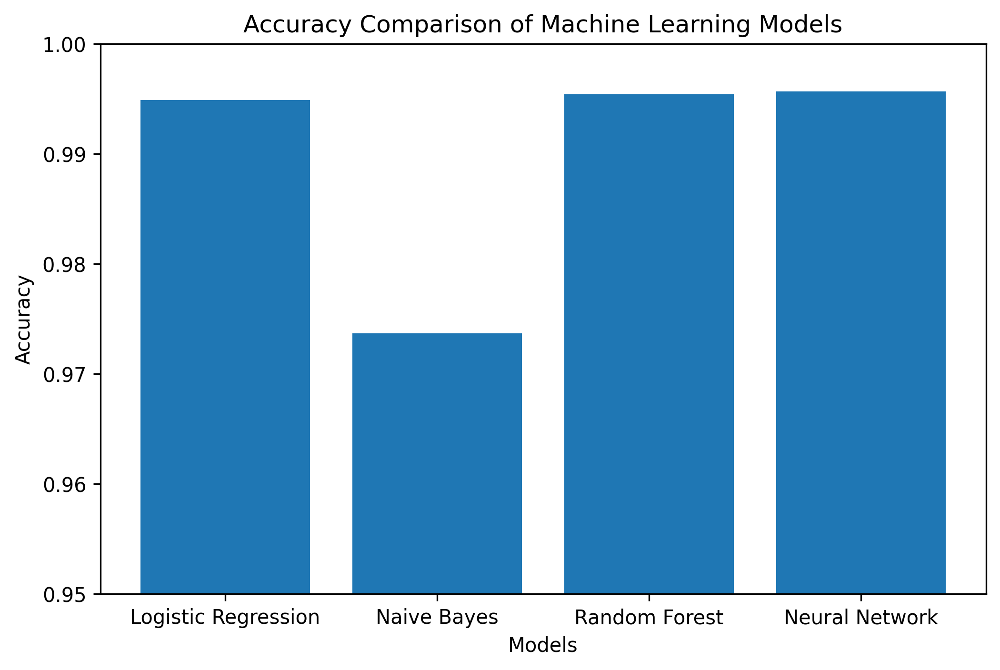
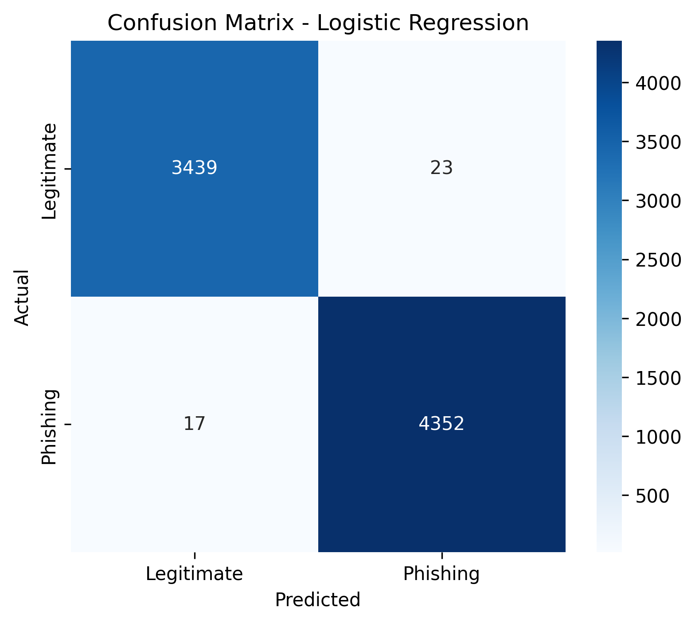
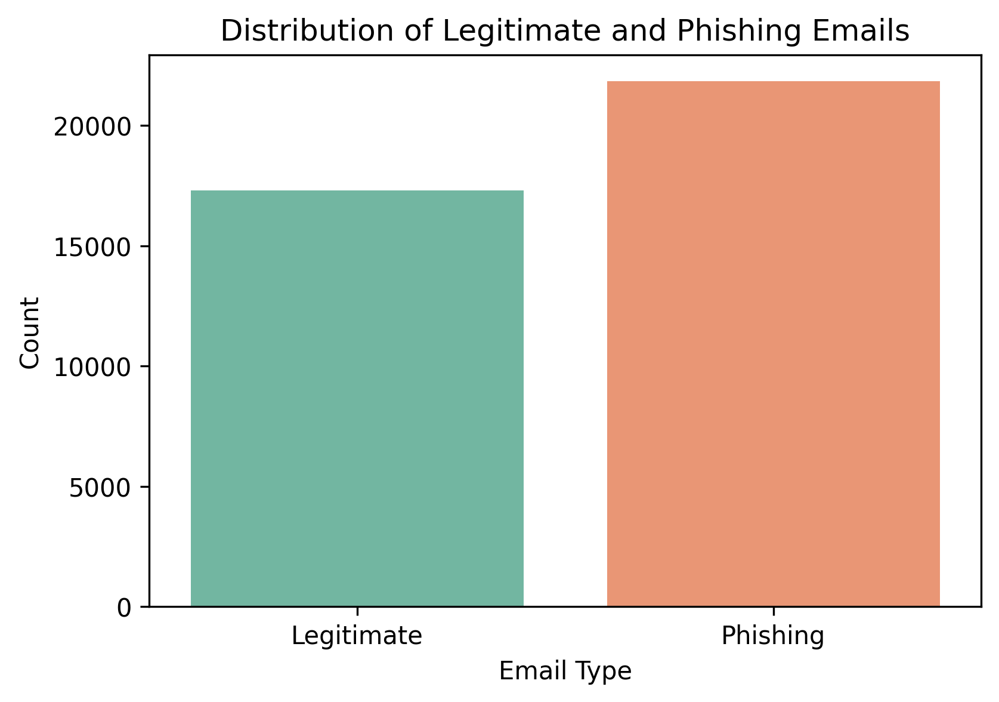
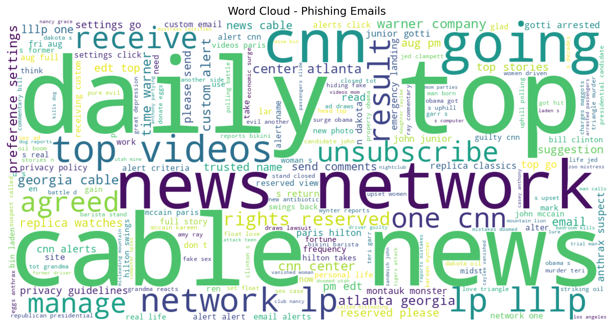
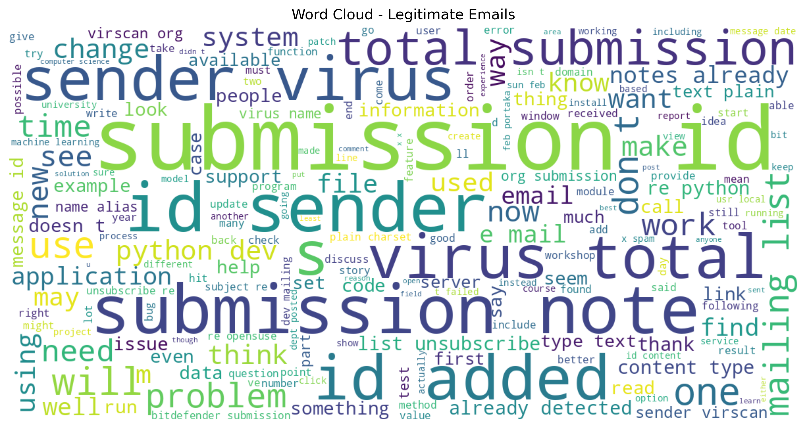

# 🛡️ AI-Driven Phishing Email Detection Using NLP

## 📖 Overview

This project uses **Natural Language Processing (NLP)** and **Machine Learning** to detect phishing emails automatically. Email text is cleaned, transformed using TF-IDF, and classified using multiple machine learning algorithms.

## 🚀 Features

- Email text preprocessing
- TF-IDF feature extraction
- Logistic Regression
- Naive Bayes
- Random Forest
- Neural Network (MLP)
- Confusion Matrix
- Classification Report
- Word Cloud
- Accuracy Comparison

## 📊 Results

| Model | Accuracy |
|-------|----------|
| Logistic Regression | **99.49%** |
| Naive Bayes | **97.37%** |
| Random Forest | **99.54%** |
| 🏆 Neural Network | **99.57%** |

## 🛠️ Technologies

- Python
- Pandas
- NumPy
- Scikit-learn
- Matplotlib
- Seaborn
- WordCloud
- Google Colab

## 📁 Dataset

CEAS 2008 Email Dataset

- 39,594 emails
- Phishing and legitimate email classification

## 📈 Workflow

1. Data Collection
2. Data Cleaning
3. Feature Engineering
4. TF-IDF Vectorization
5. Model Training
6. Model Evaluation
7. Prediction
## 📊 Results

### Model Comparison

---

### Confusion Matrix

---

### Class Distribution

---

### Phishing Word Cloud

---

### Legitimate Email Word Cloud

## 👩‍💻 Author

**Disha Pathak**

B.Tech CSE (IoT, Cybersecurity & Blockchain)

Chandigarh Engineering College, Landran

IICT Summer Internship 2026
